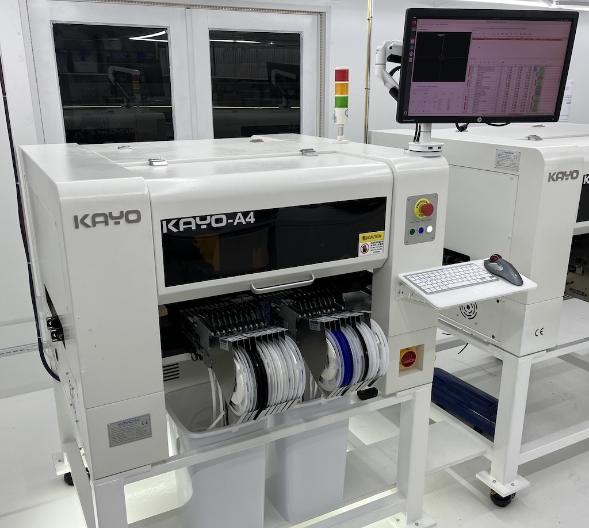
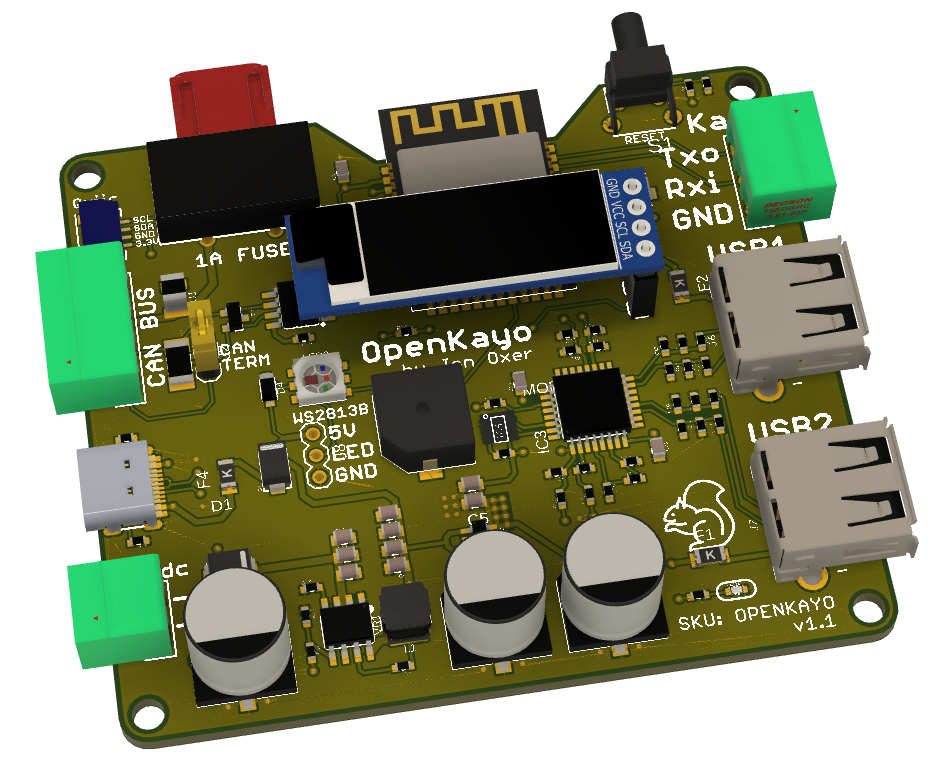
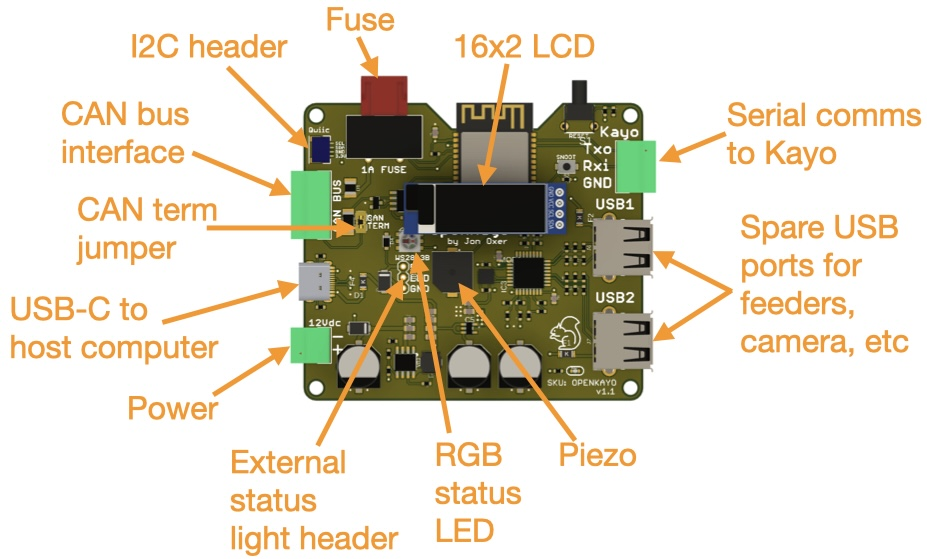

# OpenKayo Kayo-A4 GCode Adapter

Connects to the serial interface of a Kayo-A4 pick-and-place
machine, and provides a USB interface with an onboard GCode 
interpreter that translates messages into the format necessary 
for the Kayo's motion controller.

This allows Kayo machines to be controlled using [OpenPnP](https://openpnp.org/).

## Hardware Requirements

You will need a computer running OpenPnP, with sufficient USB ports 
to handle the connections to the controller, cameras, etc. This 
is a normal OpenPnP requirement so check the OpenPnP docs for 
details.

The hardware adapter portion of the project can minimally be built with an
ESP8266-based dev board such as a Wemos D1 Mini and some cables.

A dedicated ESP32-S3 hardware design is provided, which includes
additional features such as a CAN bus interface to integrate with other
devices on the production line.

**Adapter Board Features**

 * USB-C socket for connection to host computer running OpenPnP
 * ESP32-S3 MCU
 * 3-way 3.81mm screw socket for connection to Kayo serial cable
 * Onboard USB hub with 2 spare ports exposed
 * RGB LED for status display
 * Connections for external RGB LED strip for traffic-light status display etc
 * 128x32 OLED
 * Piezo for alarms
 * CAN bus interface with optional CAN termination
 * Can be powered via USB if only a serial connection + USB is required
 * Can be powered at 12V via screw terminals to pass power on to CAN bus
 * Can be powered at 12V via CAN bus if another device on the bus is powered

## Serial Connection

Kayo machines are supplied with a Windows PC running their proprietary 
control software, which is connected to a motion 
controller mounted inside the chassis via a serial connection. The
serial port is connected using a 3-way 3.81mm pitch pluggable screw 
terminal, which includes signal GND, TX, and RX:

 * Logic voltage: 3.3V
 * 115200 8N1

## Axis Configuration

The protocol converter uses the axes listed below. OpenPnP needs to be 
configured to use these same axes.

 * X: horizontal left/right
 * Y: horizontal forward/back
 * Z: virtual vertical axis for top camera, which doesn't physically move vertically
 * A, B, C, D: rotational axes for nozzles 1-4
 * I, J, K, L: z (vertical) axes for nozzles 1-4

Kayo "home" is in the top right corner at coordinates "0,0", so the 
working area is negative coordinates relative to that. That may sound 
confusing at first but it works out quite nicely in practice. For example, 
a typical board origin when clamped on the conveyor could be at something 
like "-155, -453".

Nozzles are at a 0 position when fully retracted (raised) and typically 
descend to approximately -9.8mm to touch the surface of a clamped PCB or 
feeder pickup location.

## Supported G-Codes

### Basic movement

| Code             | Meaning                                                                                              |
|------------------|------------------------------------------------------------------------------------------------------|
| G28              | Reset and home                                                                                       |
| G0 X*pos* Y*pos* | Move X & Y to the defined absolute position in mm, eg: "G0 X-23.4 Y-18"                              |
| G0 I*pos*        | Move specified nozzle vertically to absolute position in mm, eg: "G0 I-7.6" (I=n1, J=n2, K=n3, L=n4) |       
| G0 A*pos*        | Rotate specificed nozzle to an absolute angle in degrees, eg: "G0 A48" (A=n1, B=n2, C=n3, D=n4)      |

**Note:** the Kayo motion controller has an interlock on X/Y movement with Z 
axis displacement. You CANNOT move the machine in X or Y axis while holding 
a nozzle partly extended. It handles this by automatically retracting all 
nozzles whenever it gets an X/Y movement command.

This means that you can't use advanced motion planning in OpenPnP, and you 
also can't assume that you know the Z axis position of any nozzle. If you 
move the head in X/Y, all Z axes will be immediately zeroed.

### Vac / Blow
| Code             | Meaning                                                                                              |
|------------------|------------------------------------------------------------------------------------------------------|
| M2 N*noz*        | Close vac and open blow on specified nozzle, eg: "M2 N2"                                             |
| M3               | Close vac and blow on all nozzles                                                                    |
| M4 N*noz*        | Open blow on selected nozzle, eg: "M4 N3"                                                            |
| M5 N*noz*        | Close blow on selected nozzle, eg: "M5 N2"                                                           |
| M6 N*noz*        | Open vac on selected nozzle, eg: "M6 N1"                                                             |
| M7 N*noz*        | Close vac on selected nozzle, eg: "M7 N1"                                                            |

### Conveyor Belt
| Code             | Meaning                                                                                              |
|------------------|------------------------------------------------------------------------------------------------------|
| M2               | Reset conveyor                                                                                       |
| M21 N*width*     | Adjust conveyor to specified width + configured margin, eg: "M21 N93.4"                              |
| M22              | Ingest a PCB and clamp it in position                                                                |
| M23              | Unclamp PCB and move it to the exit location                                                         |
| M24              | Start conveyor                                                                                       |
| M25              | Stop conveyor and drop pin                                                                           |
| M26              | Engages the stop pin                                                                                 |
| M27              | Clamp a PCB on the conveyor                                                                          |

###Lights
| Code              | Meaning                                                                                             |
|-------------------|-----------------------------------------------------------------------------------------------------|
| M30               | Turn off camera lights                                                                              |
| M31 S*brightness* | Turn on fast camera light at specificed brightness %, eg: "M31 S15"                                 |
| M32 S*brightness* | Turn on precision camera light at specified brightness %, eg: "M32 S46"                             |

### Status
| Code             | Meaning                                                                                              |
|------------------|------------------------------------------------------------------------------------------------------|
| M114             | Report position                                                                                      |
| M115             | Report firmware type and version                                                                     |

###Feeders
| Code             | Meaning                                                                                              |
|------------------|------------------------------------------------------------------------------------------------------|
| M600 N*feeder*   | Open specified feeder, eg: "M600 N12"                                                                |
| M601             | Close feeders (no need to specify)                                                                   |

**Note:** The Kayo motion controller only ever allows a single feeder to be open 
at a time, and there is no command to close a specific feeder. M601 closes 
whatever is open.

### Diagnostic
| Code               | Meaning                                                                                            |
|--------------------|----------------------------------------------------------------------------------------------------|
|M99 N*noz* S*steps* | Send microsteps to specified nozzle rotation stepper, eg: "M99 N1 S1234"                           |

## Camera Modifications

I have been unable to connect the 5 factory bottom cameras (1 x precision 
camera and a 4-way high-speed camera array) to OpenPnP. On my machines 
I have unscrewed the 4-way camera array and tucked it away inside the 
machine, and also removed the precision camera. I replaced that with an 
ELP Mini 720p OV9712 USB industrial camera with a 6mm lens, using a 
3D-printed camera mount and a lens spacer to change the focal length.

This particular camera is very commonly used for OpenPnP so it's a 
well-known and well-supported device.

The top camera has an analog output. I connected it to an analog-to-HDMI 
converter, which then goes to a cheap HDMI-to-USB converter so that it 
appears as a webcam under Linux and can be accessed by OpenPnP.

## Kayo Protocol

The control protocol for the Kayo motion controller uses 8-byte 
messages in both directions, with no terminator. Message boundaries 
are discovered by watching for a leading character, tracking the 
number of bytes received, and timing out as a fallback to handle 
incomplete messages or errors.

The protocol is embodied in the source code. Docs to be added here 
later.

## Hardware

The "Hardware" directory contains the PCB design as an EAGLE project. 
This can be imported into KiCAD, or opened natively using Fusion360.

## Firmware

The "Firmware" directory contains example firmware as an Arduino
project.

## Credits

 * Jonathan Oxer <jon@oxer.com.au>

Heavily inspired by Glen English's Python-based UI for the Kayo, in
particular his work decoding the message format used by the factory
software.

## License

Copyright 2022-2025 SuperHouse Automation Pty Ltd  www.superhouse.tv  

The hardware portion of this project is licensed under the TAPR Open
Hardware License (www.tapr.org/OHL). The "license" folder within this
repository contains a copy of this license in plain text format.

The software portion of this project is licensed under the Simplified
BSD License. The "licence" folder within this project contains a
copy of this license in plain text format.

